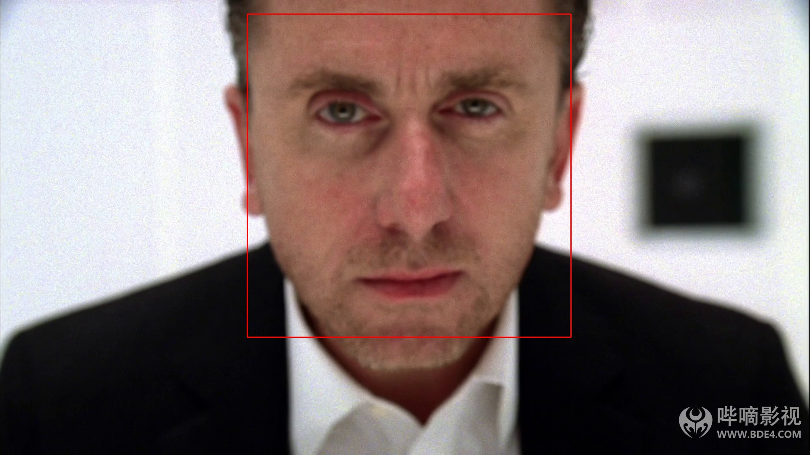
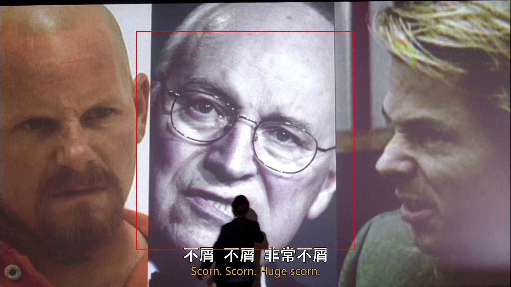
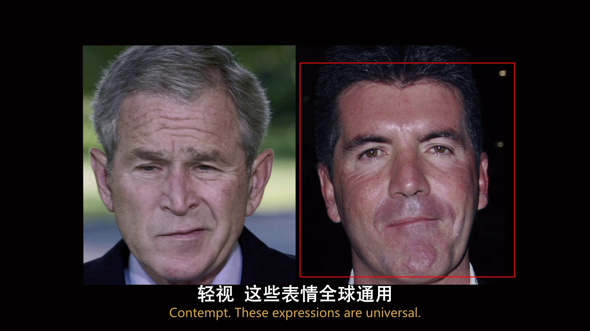

# lietome
#### 受美剧《千谎百计》启发，使用人脸识别技术实现人脸的相关技术：人脸识别、人脸比对、人脸搜索；表情识别、人脸标签、行为识别；

**通过用项目带动学习，将学习的技术：**
- 1.Python
- 2.OpneCV
    - 2.1 dlib
    - 2.2 face_recognition

- 3.机器学习

- 环境配置
    -  windows安装

        * 1.vs2019 , windows SDK,opencv-python
        * 2.pip install cmake 
        * 3.pip install dlib
        * 4.pip install face_recognition
- 模型下载地址
  - Haar特征可以理解为卷积模板
    - https://github.com/opencv/opencv/blob/master/data/haarcascades
  - 本地cv2
    - External Librarise  Lib\site-packages\cv2\data\haarcascade_frontalcatface.xml 

- trainer 训练获取 id xml
- AttributeError: module 'cv2' has no attribute 'face'
  - pip install opencv-contrib-python
- TODO:
  - haarcascade 需要自己根据情况自己训练 人脸级联分类器

